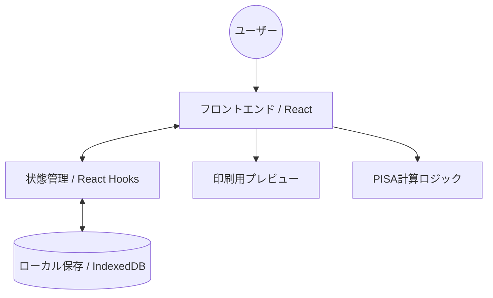
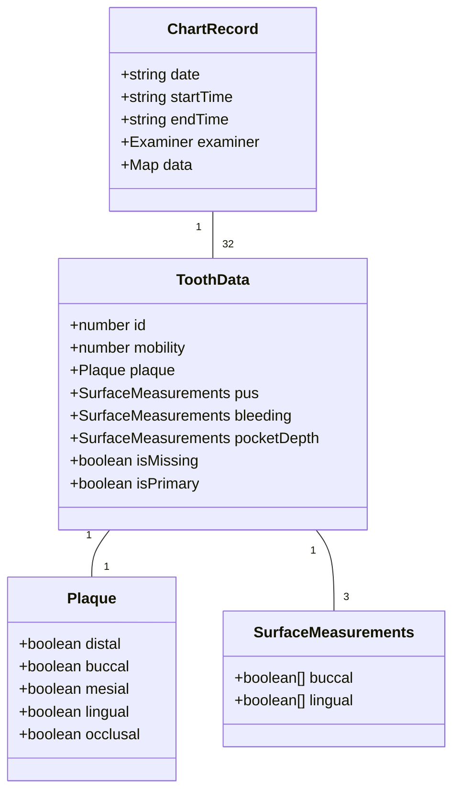

# 要件定義書：スマート歯周検査チャート (Smart Perio Chart)

## 1. プロジェクト概要
本プロジェクトは、歯科医院における歯周病検査の記録（歯周ポケット測定、出血、排膿、動揺度、プラーク付着状況）を効率化し、iPad等のタブレット端末で直感的に操作できるWebアプリケーションの開発を目的としています。

### 目的
- 検査入力時間の短縮
- PISA（歯周炎症表面積）等の自動計算による診断支援
- 過去データとの視覚的な比較による治療経過の把握
- ペーパーレス化とデータの蓄積

## 2. システム構成図

## 3. 機能要件

### 3.1. 歯式入力・管理機能
- **歯のステータス管理**: 
    - 永久歯 (1-8) および 乳歯 (A-E) の切り替え
    - 欠損歯の指定
    - 一括設定機能（全欠損、全乳歯、リセット）
- **ナビゲーション**: 
    - 4つのクアドラント（右上・左上・右下・左下）の切り替え
    - ミニマップによる現在地の視覚的表示
    - iPadでの片手操作を考慮した矢印キーによる移動

### 3.2. 検査項目入力
- **ポケット深さ (PD)**: 1点法、4点法、6点法の切り替えに対応
- **出血 (BOP) / 排膿 (P)**: 各部位（6点法の場合は各測定点）に対して記録可能
- **動揺度 (Mobility)**: 0〜3度の4段階で記録
- **プラーク付着 (PCR)**: 5面（遠心・頬側・近心・舌側・咬合面）の記録

### 3.3. 計算・分析機能
- **PISA (Periodontal Inflamed Surface Area) 計算**:
    - 6点法のデータに基づき、炎症表面積を自動算出
    - グラフおよび数値でのプレビュー表示
- **比較モード**:
    - 過去の検査データを選択し、現在のデータと並べて表示
    - 治療による改善状況を視覚的に比較可能

### 3.4. 運用・管理機能
- **診療時間管理**:
    - 開始時間、終了時間の入力（「現在時刻」セットボタンあり）
    - 所要時間の自動計算（デフォルト15分設定）
    - 5分追加ボタンによる微調整
- **担当者選択**:
    - 複数の検査担当者から選択可能（カラーコーディング対応）
- **カレンダー機能**:
    - 日付ごとの検査記録の保存・読み込み
    - 記録がある日付のマーキング表示

## 4. 画面設計 (UI/UX)

### 4.1. エディタ画面
- **iPad最適化**: 
    - タッチミスを防ぐための大きなボタン配置
    - クアドラントごとに拡大表示されるUI（1/4ビュー）
- **リアルタイム表示**: 
    - 入力した数値やステータス（出血の赤、排膿の黄色）を即座に反映

### 4.2. プレビュー・印刷画面
- **全顎表示**: 1枚のチャートに全顎のデータを集約
- **ピンチズーム**: iPadのジェスチャーによる自由な拡大縮小
- **印刷対応**: ブラウザの印刷機能を使用してA4サイズ等に出力可能

## 5. データモデル

## 6. 技術スタック
- **Frontend**: React (TypeScript), Vite
- **Styling**: Tailwind CSS
- **Database**: IndexedDB (Dexie.js 等のラッパー使用を想定)
- **Icons**: Lucide React / Heroicons

## 7. 非機能要件
- **オフライン動作**: インターネット接続がない環境でもデータの入力・保存が可能であること
- **レスポンシブ**: iPadの縦持ち・横持ちの両方に対応（特に縦持ちでの操作性を重視）
- **パフォーマンス**: 多数の入力項目があるが、入力遅延が発生しないこと
